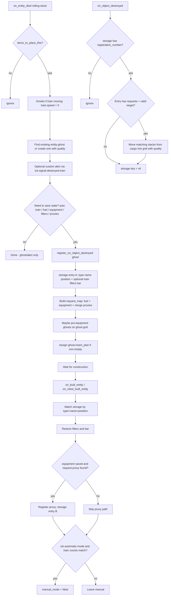

# Migration / debug report: Factorio 2.0 port

**Mod:** `kris-ick-automatic-train-repair`  
**From:** `1.1.4` (`factorio_version` 1.1)  
**To:** `2.0.0` (`factorio_version` 2.0, `dependencies`: `base >= 2.0.0`)  
**Target runtime:** Factorio **2.0.77** (and other 2.0 builds compatible with the declared dependency)  
**Scope of this document:** Accurate notes from the current workspace code (`control.lua`, `info.json`, `changelog.txt`, `settings.lua`, `data.lua`, `README.md`) compared to tag/commit **1.1.4**. For future debugging by someone who owns this repo but is new to Factorio modding.

---

## 1. Summary

This port keeps the same gameplay idea as 1.1.x:

1. When rolling stock dies → stop the train, ensure a ghost exists, optionally alert players.
2. Save useful state (fuel/equipment requests, cargo filters/bar, automatic-mode carriage counts).
3. When the ghost is rebuilt → restore filters/bar and try to put the train back into automatic mode when the carriage-type counts match.
4. For cargo-wagon equipment, use a fallback path that moves items from cargo into the grid when the item-request proxy is destroyed.

What changed for 2.0 is mostly **runtime API** and **how item requests are expressed**:

| Area | 1.1.4 | 2.0.0 |
|------|-------|-------|
| Persistent mod table | `global.ick_destroyed_train` | `storage.ick_destroyed_train` |
| Built-entity event field | `event.created_entity` | `event.entity` |
| Item prototype lookup | `game.item_prototypes[...]` | `prototypes.item[...]` |
| Destroy registration / event | `register_on_entity_destroyed` / `on_entity_destroyed` | `register_on_object_destroyed` / `on_object_destroyed` |
| Ghost item requests | writable `ghost_entity.item_requests = { [name]=count }` | `ghost_entity.insert_plan = { BlueprintInsertPlan... }` with quality |
| Inventory / grid contents | often `name → count` maps | arrays of `{name, count, quality?}` |
| Quality | none | preserved on fuel, equipment, requests, ghost creation |

Mod version is now **`2.0.0`**. Declared Factorio API line is **`factorio_version`: `"2.0"`**.

---

## 2. Files changed

| File | Changed? | Why |
|------|----------|-----|
| `control.lua` | **Yes (main work)** | Full 2.0 runtime rewrite: helpers for quality/`insert_plan`, ghost reuse, `storage`, new destroy event, safer nil/`train`/`cargo_inv` checks, equipment ghost grid placement, quality-aware cargo→grid restore. |
| `info.json` | **Yes** | `version` `1.1.4` → `2.0.0`; `factorio_version` `1.1` → `2.0`; dependency `base >= 1.1.48` → `base >= 2.0.0`. |
| `changelog.txt` | **Yes** | New `Version: 2.0.0` section documenting the port and API/request changes. |
| `settings.lua` | **No** | Same setting names, types, defaults, orders. |
| `data.lua` | **No** | Same virtual signal `ick-signal-destroyed-train` and subgroup. |
| `README.md` | **No** | Same player-facing description and known issues. |
| `locale/**` | **No** (for this port) | Setting names / alert tooltip keys unchanged; no locale edits required for the API migration. |
| `MIGRATION_2.0_REPORT.md` | **Added** | This document only; does not affect gameplay. |

---

## 3. API migration map

Old → new, with where it shows up in this mod.

| Old (1.1) | New (2.0) | Context in this mod |
|-----------|-----------|---------------------|
| `global` | `storage` | All reads/writes of `ick_destroyed_train` in death / build / destroy handlers. |
| `event.created_entity` | `event.entity` | `on_built_entity` and `on_robot_built_entity` → `built_entity(...)`. |
| `game.item_prototypes[name]` | `prototypes.item[name]` | Fuel-type setting check; also stack size in `build_insert_plan`. |
| `script.register_on_entity_destroyed(entity)` | `script.register_on_object_destroyed(entity)` | Ghost registration on death; item-request-proxy registration on build (cargo equipment path). |
| `defines.events.on_entity_destroyed` | `defines.events.on_object_destroyed` | Cleanup + cargo→grid equipment move; keyed by `event.registration_number`. |
| `ghost.item_requests = { [name]=count }` | `ghost.insert_plan = { {id={name,quality}, items={...}} }` | End of death handler after `build_insert_plan`. |
| `Inventory.get_contents()` as `{[name]=count}` | array of `{name, count, quality}` | Fuel inventory and `entity.grid.get_contents()` loops. |
| `proxy.item_requests` as `{[name]=count}` | Prefer `proxy.insert_plan`; fallback `proxy.item_requests` as item array | Existing request-proxy merge on death. |
| `inventory.find_item_stack(name)` | `inventory.find_item_stack({name=..., quality=...})` | `on_object_destroyed` equipment restore. |
| `grid.put{name=name}` | `grid.put{name=..., quality=...}` (and ghost put with `position` / `ghost=true`) | Destroy handler + death-time equipment ghosts on `ghost_entity.grid`. |
| `game.surfaces[entity.surface.name]....` | `entity.surface` / local `surface` | Smoke, find ghosts/proxies, create ghost. |
| Always assume `entity.train` exists | Guard with `if train then` | Smoke, stop, and “save automatic train composition” branches (avoids fluid-wagon-style nil issues from older versions). |

### New local helpers (all in `control.lua`)

| Helper | Role |
|--------|------|
| `quality_name(quality)` | Normalize `nil` / string / QualityID-like object → quality name string (default `"normal"`). |
| `request_key(name, quality)` | Unique map key: `name .. "\0" .. quality`. |
| `add_request(request_map, name, quality, fuel_count, grid_count)` | Accumulate fuel vs equipment/grid counts per item+quality. |
| `build_insert_plan(request_map)` | Convert map → `insert_plan` array: fuel uses `items.in_inventory` with `defines.inventory.fuel` + stack indices; equipment uses `items.grid_count`. |
| `merge_insert_plans(request_map, plans)` | Fold an existing proxy/`insert_plan` into the same map (fuel inventory slots vs `grid_count`). |

---

## 4. Behavioral changes (intentional)

These are real logic differences vs 1.1.4, not just renames.

### 4.1 Ghost reuse (avoid duplicates)

**1.1.4:** Always `create_entity{ name = "entity-ghost", ... }` at the death position.

**2.0.0:** First `find_entities_filtered` for `entity-ghost` at the same position/force; if one with `ghost_name == entity.name` exists, **reuse it**. Only create a new ghost if none found. Early `return` if still no ghost.

Why: Factorio 2.0 can create death ghosts via `create_ghost_on_death` / force settings. Creating another ghost caused duplicates.

Also new: created ghosts pass `quality = entity.quality`.

### 4.2 `insert_plan` instead of writable `item_requests`

**1.1.4:** Built a flat `requests` table `{ [item_name] = count }` and assigned `ghost_entity.item_requests = requests`.

**2.0.0:** Builds a `request_map`, then `ghost_entity.insert_plan = build_insert_plan(request_map)` only if non-empty.

Implications:

- Fuel and equipment are separated (`fuel_count` vs `grid_count`).
- Fuel requests are split across inventory stacks using `prototypes.item[name].stack_size` (fallback stack size `50`).
- Quality is part of every request id.
- Forced fuel from settings (`ick-fuel-type` / `ick-fuel-amount`) is always quality `"normal"`.
- Empty fuel-type string is checked explicitly (`fuel_type ~= ""`) before prototype lookup (cleaner than relying only on missing prototype).

### 4.3 Quality everywhere contents are read

Loops that used `for name, count in pairs(...)` now use `for _, item in pairs(...)` with `item.name`, `item.count`, `item.quality`.

Cargo-wagon saved `equipment` / `requests` is no longer a name→count map; destroy handler iterates array entries with quality.

### 4.4 Equipment ghosts on the entity-ghost grid

When `ick-include-equipment` is on and the dead entity had equipment:

1. If `ghost_entity.grid` exists and is empty, `put` each equipment as a **ghost** (`ghost = true`) at the same position/quality.
2. Still add `grid_count` requests via `insert_plan` from `entity.grid.get_contents()`.
3. Still save `equipment` on cargo-wagons for the cargo→grid fallback.

Skip putting equipment ghosts if the ghost grid already has equipment (vanilla may have copied them).

### 4.5 Existing item-request-proxy merge

If proxies targeted the dying entity:

- Prefer `proxy.insert_plan` via `merge_insert_plans`.
- Else fall back to `proxy.item_requests` array; fuel inventory present → treat as fuel requests, else as `grid_count`.

### 4.6 Safer build / destroy paths

- Prefer `entity.item_request_proxy`, then `find_entity("item-request-proxy", ...)`.
- Cargo filter/bar restore only if `get_inventory(cargo_wagon)` is non-nil.
- Automatic mode restore requires `entity.train` to exist.
- Destroy handler requires `registered_entity.target.valid` before touching inventory/grid.
- Removed leftover debug `game.print(carriage.orientation)` that existed in 1.1.4 death smoke code.
- Loop variable shadowing fixed (`carriage` instead of reusing `entity`).

### 4.7 Registration condition tweak

Special-property save still runs when automatic train (non-train cause), equipment, fuel, filters/bar, or proxies exist — same intent. `has_equipment` is cached; train-related parts are nil-safe with `train and ...`.

---

## 5. Unchanged

| What | Status |
|------|--------|
| Core intent | Stop train on rolling-stock death, ghost + requests, restore filters/bar, optional auto mode when composition matches. |
| Settings names | `ick-alert`, `ick-automatic-mode`, `ick-include-equipment`, `ick-include-fuel`, `ick-fuel-type`, `ick-fuel-amount` |
| Setting defaults | Alert true; automatic-mode **false**; include equipment/fuel true; fuel type `""`; fuel amount `1` |
| `data.lua` signal | `ick-signal-destroyed-train` + subgroup `ick-virtual-signal-alert` |
| Locales / alert text key | `gui-alert-tooltip.ick-destroyed-train` |
| Event filters | Still `{{filter = "rolling-stock"}}` on death/build events |
| Auto-mode heuristic | Count locomotives / cargo / fluid / artillery wagons; enable when counts equal; still skips if destroyed by another train (`event.cause.train ~= nil`) |
| README known issues | Multi-wagon rebuild order; simple completeness check; equipment via cargo then grid; wagon request icon grouping |

---

## 6. Architecture notes

### 6.1 How `storage.ick_destroyed_train` is keyed

```text
storage.ick_destroyed_train = {
  [registration_number] = <entry>,
  ...
}
```

`registration_number` comes from `script.register_on_object_destroyed(...)`. When that registered Lua object is destroyed, `on_object_destroyed` fires with the same number.

There are **two entry shapes**:

**A — Ghost entry** (created on rolling-stock death when special properties apply):

```lua
{
  type = entity.type,          -- "locomotive", "cargo-wagon", etc.
  name = entity.name,
  position = entity.position,  -- exact x/y match used on rebuild
  train = {                    -- optional: only if auto-mode train, not killed by a train
    ["locomotive"] = n,
    ["cargo-wagon"] = n,
    ["fluid-wagon"] = n,
    ["artillery-wagon"] = n,
  },
  equipment = <grid.get_contents()>,  -- optional: cargo-wagon only
  filters = { [slot] = filter, ... }, -- optional
  bar = number,                       -- optional inventory limit
}
```

**B — Proxy entry** (created on build when ghost entry had `equipment` and a request proxy exists):

```lua
{
  position = entity.position,
  requests = stored_info.equipment,  -- array of {name, count, quality?}
  target = entity,                   -- living cargo wagon LuaEntity
}
```

Matching on rebuild is **not** by registration number: `built_entity` scans all stored entries and matches `type` + `name` + exact `position.x` / `position.y`.

When a registered ghost (or proxy) is destroyed, that key is set to `nil` after optional equipment restore.

### 6.2 Death / build / destroy flow



**Prose version:** Death creates/reuses a ghost and, if needed, remembers that ghost under a destroy-registration id. Build looks up remembered ghosts by identity+tile position, restores wagon settings, and may register the temporary item-request proxy. When that proxy (or the ghost) is destroyed, the mod cleans storage; for cargo equipment it tries one last time to install modules from the wagon inventory into the grid.

---

## 7. Known risks / in-game test checklist

Run these in Factorio **2.0.x** with only this mod (plus base), then again with your usual modpack if needed.

### Setup

- [ ] Mod loads: `info.json` shows **2.0.0**, no load error in the log.
- [ ] Map settings: turn **Automatically enable automatic mode** ON for auto-mode tests (default is OFF).
- [ ] Leave fuel/equipment request settings ON unless testing the OFF paths.
- [ ] Construction bots + roboport coverage at the crash site; enough items in the network.

### Core ghost / stop

- [ ] Destroy a moving locomotive (biters / artillery / script). Train should stop; smoke on non-locomotive carriages if speed &gt; 0.
- [ ] Confirm **one** ghost (not two stacked) when force/ghost-on-death is enabled.
- [ ] Confirm ghost quality matches a quality locomotive/wagon if Space Age quality is available.

### Fuel requests

- [ ] Locomotive with coal (or other fuel) in burner → ghost `insert_plan` requests that fuel (hover / look at ghost requests).
- [ ] Set `ick-fuel-type` to a valid fuel name and `ick-fuel-amount` to N → ghost requests N of that fuel at normal quality instead of whatever was in the burner.
- [ ] Clear fuel-type setting → back to “whatever was destroyed.”
- [ ] Disable `ick-include-fuel` → no fuel requests from this mod.

### Equipment

- [ ] Locomotive with grid equipment → equipment ghosts and/or grid requests on the entity ghost; bots refill after rebuild.
- [ ] Cargo wagon with equipment → after rebuild, items may land in cargo first; when the request proxy finishes/disappears, equipment should move into the grid (fallback path).
- [ ] Disable `ick-include-equipment` → no equipment requests / no cargo fallback registration from equipment.

### Filters / bar

- [ ] Filtered cargo wagon → filters restored after bot/player revive.
- [ ] Cargo wagon with inventory limit (bar) → bar restored.

### Automatic mode

- [ ] Automatic train destroyed by biters (not by another train) → after **all** carriages of that train are rebuilt in a composition that matches saved type counts, train returns to automatic (with setting ON).
- [ ] Same train destroyed by another train → should **not** save/restore automatic mode via the `train` field.
- [ ] Multi-wagon destruction: rebuild order still matters (see README); incomplete composition stays manual.

### Alerts

- [ ] Player setting `ick-alert` ON → custom alert with destroyed-train signal.
- [ ] Setting OFF → no alert for that player.

### Edge cases

- [ ] Fluid wagon death does not hard-error (train nil-safe).
- [ ] Rolling stock without `items_to_place_this` is ignored (1.1.4 bugfix still present).
- [ ] Manual-mode train with only filters still restores filters without forcing auto mode.

---

## 8. Debugging tips

### 8.1 Log file

On Windows, open:

`%AppData%\Factorio\factorio-current.log`

Useful things to search:

| Search / look for | Meaning |
|-------------------|---------|
| `kris-ick-automatic-train-repair` | Mod load / script errors from this mod. |
| `Error while running event kris-ick-automatic-train-repair` | Exact handler (`on_entity_died`, `on_built_entity`, `on_object_destroyed`, etc.) and Lua stack. |
| `insert_plan` / `BlueprintInsertPlan` | Bad plan shape if Factorio rejects assignment. |
| `register_on_object_destroyed` | Registration API misuse. |
| `attempt to index field 'train' (a nil value)` | Missing `train and` guard (should be fixed in 2.0.0). |
| `item_requests` | Code still using 1.1 writable assignment somewhere. |

Also check `factorio-previous.log` if the game crashed and rotated logs.

### 8.2 Useful temporary `game.print` spots

Add temporarily in `control.lua`, then remove before release:

1. **After ghost resolve (death)** — confirm reuse vs create:
   - Print `ghost_entity.unit_number`, `ghost_entity.ghost_name`, and whether an existing ghost was found.
2. **After `build_insert_plan`** — print `#insert_plan` and each `id.name`, `id.quality`, fuel vs `grid_count`.
3. **Start of `built_entity`** — print entity `name`, `position`, and whether a storage match was found.
4. **Before `manual_mode = false`** — print `old_train` vs `new_train` counts.
5. **In `on_object_destroyed`** — print `event.registration_number`, whether entry has `requests`, and `target.valid`.

Example pattern:

```lua
game.print({"", "[ick] insert_plan size=", #insert_plan})
```

Use the in-game console (`~`) only for one-off checks; prefer temporary prints in the mod while iterating.

### 8.3 Common failure modes

| Symptom | Likely cause | Where to look |
|---------|--------------|---------------|
| **Two ghosts** on one death | Reuse find failed (wrong force/position/name) or another mod creates a second ghost later | Death handler ghost find/create; compare `ghost_name` and force |
| **Empty / missing insert_plan** | Fuel/equipment settings off; inventories empty; `build_insert_plan` produced `{}` so assignment skipped; forced fuel type invalid/blank | Settings; `add_request` / `build_insert_plan`; `prototypes.item[fuel_type]` |
| **Wrong fuel amount / quality** | Forced fuel always `"normal"`; stack splitting; contents API shape | Fuel branch; quality on `get_contents()` |
| **Auto mode not restoring** | Setting still false (default); train killed by another train; carriage counts don’t match; rebuild order; `entity.train` nil; position mismatch so `built_entity` never matches | `storage` entry `.train`; build matcher; README known issues |
| **Filters/bar not restored** | No storage match (position/name); wagon had no filters/bar saved; `cargo_inv` nil | Death save of `filters`/`bar`; build restore |
| **Equipment not filling** | `ick-include-equipment` off; bots lack items; ghost grid already non-empty so put skipped; cargo-wagon path needs proxy registration; destroy ran when `target` invalid; quality mismatch on `find_item_stack` | Equipment put + `insert_plan`; proxy register in `built_entity`; destroy loop |
| **Alert missing** | Per-player `ick-alert` false; different force | Alert loop in death handler |
| **Crash on death** | Unexpected nil (train/ghost); bad `insert_plan` field | `factorio-current.log` stack trace |

### 8.4 Inspecting storage in a running game (advanced)

From the console (single-player / if cheats allow script):

- Conceptually you want `storage.ick_destroyed_train` after a death-with-state and before the ghost is fully processed.
- If the table is empty after death, the “special properties” `if` did not run, or registration never happened.
- If entries remain forever, `on_object_destroyed` may not be firing for that registration (object never destroyed, or wrong API).

---

## 9. Version

| Field | Value |
|-------|-------|
| Mod version | **`2.0.1`** (was `2.0.0` at initial 2.0 port) |
| `factorio_version` | **`2.0`** |
| Dependency | **`base >= 2.0.0`** |
| Changelog date | **2026-07-22** |
| Baseline compared in this report | **1.1.4** (`0d6a59d` / tag `v1.1.4`) |

---

## Quick reference: events this mod listens to

| Event | Filter | Purpose |
|-------|--------|---------|
| `on_entity_died` | rolling-stock | Stop train, ghost, alert, save state, set `insert_plan`, attach repair job |
| `on_built_entity` | rolling-stock | Restore filters/bar; clear job pending; complete job (auto + schedule/group) |
| `on_robot_built_entity` | rolling-stock | Same as player build |
| `on_object_destroyed` | (registration) | Cargo→grid equipment; cancel pending / abandon empty jobs; delete storage entry |

No `on_init` / `on_configuration_changed` migration of old `global` data is present: a save that somehow carried pre-2.0 `global` tables would not automatically map into `storage` by this mod’s code. Fresh 2.0 play / normal 2.0 save migration by the game is the expected path.

---

## 10. Consistency review (post-port)

Review verdict: **ready for smoke test**. No critical load/core-flow bugs fixed; none found that block vanilla loco/wagon death → ghost → rebuild.

### Residual issues (not fixed in 2.0.0)

| Severity | Issue |
|----------|--------|
| Medium | ~~Carriage composition uses a fixed 4-type map~~ **Fixed in 2.0.1** via dynamic type counts. |
| Medium | Ghost reuse runs in `on_entity_died`; vanilla death ghosts often appear in `on_post_entity_died`, so reuse may not catch engine ghosts. Duplicate-ghost risk if rolling stock gets `create_ghost_on_death`. |
| Low–Medium | `merge_insert_plans` maps non-fuel `in_inventory` → `grid_count` (heuristic). Wrong for true cargo/ammo inventory requests; OK for typical fuel/equipment. |
| Low | Build matching is type/name/position only — quality ignored. |
| Low | In-flight 1.1 save data with map-shaped `equipment` silently no-ops under array-shaped reader. |
| Low | No `script_raised_built` / `script_raised_revive` — script revives skip restore. |

### Confirmed correct

- All six settings wired; `storage` only; `event.entity` / `on_object_destroyed` / `prototypes.item` / `insert_plan`
- Fuel stack splitting (0-based stacks); equipment `grid.put{ghost=true}` + `grid_count`
- Cargo-wagon fallback path still coherent; filters/bar and train nil-safety improved vs 1.1

---

## 11. Version 2.0.1 — multi-car repair jobs

| Storage | Purpose |
|---------|---------|
| `storage.ick_repair_jobs[job_id]` | Shared incident: `expected` counts, `pending` ghost regs, `survivor_unit_numbers`, `group` / `schedule`, `was_automatic` |
| `storage.ick_destroyed_train[reg].job_id` | Links each ghost registration to its job |
| `storage.ick_next_job_id` | Monotonic job id |

**Behavior:** First eligible death snapshots full consist; later deaths of survivors join the same job. Auto-mode + group/schedule restore run only when **all** pending ghosts for that job are built and type counts match — rebuild order no longer matters.

**Setting:** `ick-automatic-mode` default is **true**.
